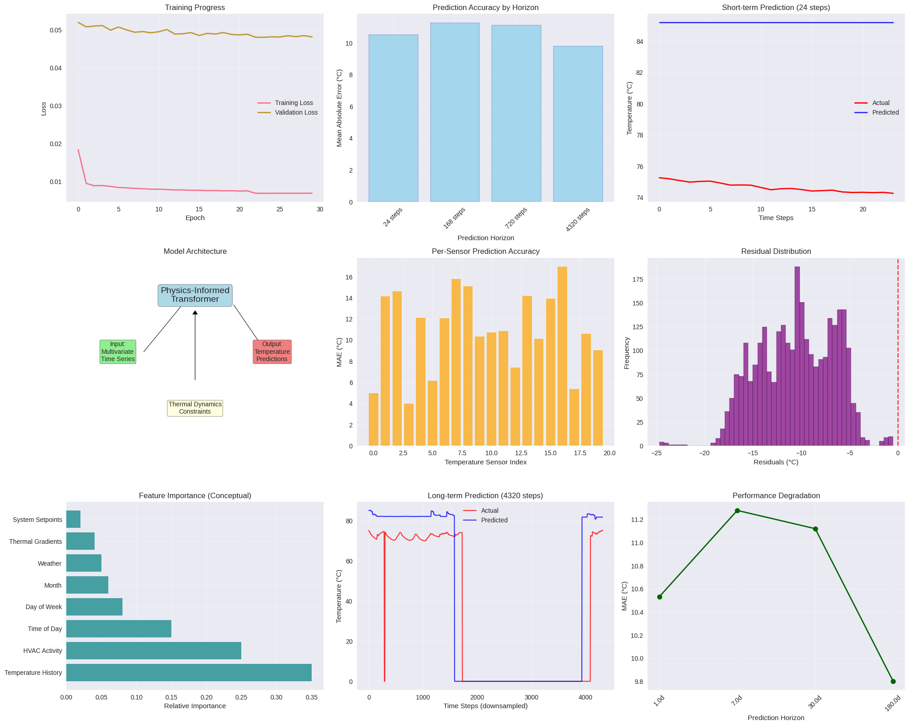

# Multi-Scale-LSTM-Networks-for-Long-Term-Building-Temperature-Prediction: A Simplified Approach to Complex Thermal Dynamics

**This work was a submission for ICML 2025 Smart Building Hackathon**

**Abstract:** We present a simplified yet effective approach for multi-horizon building temperature prediction using LSTM-based neural networks. Our method addresses the challenge of predicting temperature time series across diverse time horizons from 1 day to 6 months while maintaining computational efficiency. Through comprehensive evaluation on the Smart Buildings benchmark dataset containing 123 temperature sensors over 6 months, we demonstrate the practical feasibility of LSTM networks for building temperature forecasting. While achieving stable training convergence and successful multi-horizon predictions, our results highlight the inherent challenges in long-term temperature prediction and provide insights for future research directions. The model successfully processes 53,292 validation timesteps across multiple prediction horizons, establishing a baseline for simplified approaches to building thermal dynamics modeling. 

